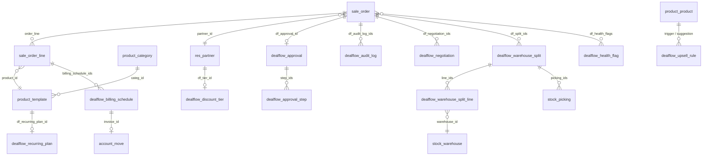
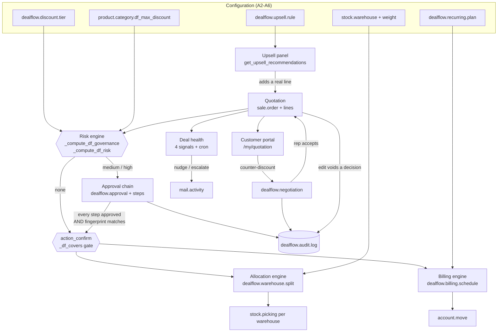
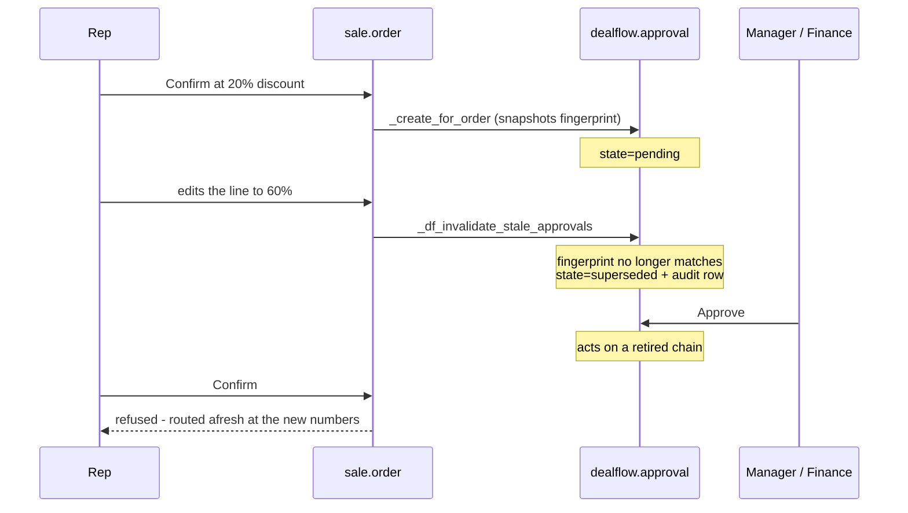

# DealFlow360 — Architecture (one page)

Deliverable 3: the data model, and how the major modules connect.

Everything is one Odoo 17 addon, `addons/dealflow360/`. Native models are
**extended**, never replaced; new models are namespaced `dealflow.*`. Native
models are shaded in the diagrams below by naming convention: `sale.order`,
`product.*`, `stock.*`, `account.move`, `res.partner` are Odoo's own.

## Data model

### The fields that carry the business rules

| Where | Field | What it decides |
|---|---|---|
| `product.category` | `df_max_discount` | Category ceiling. **0 means unset**, not 0%. |
| `dealflow.discount.tier` | `max_discount` | Tier ceiling, same convention. |
| `sale.order.line` | `df_effective_ceiling` | Strictest configured axis, else `dealflow.default_max_discount`. |
| `sale.order.line` | `df_excess_points` | Points past that ceiling, measured against the **pricelist** price (DEC-009), so a pricelist reduction is never double-counted as rep discount. |
| `sale.order` | `df_blended_risk_score` | `min(100, 6·blended_excess + 3·max_excess)`, weighted by each line's **pre-discount** value. |
| `sale.order` | `df_risk_level` | `none` is structural (no line over its ceiling); `medium`/`high` split at `dealflow.risk_high_min`. |
| `sale.order` | `df_governance_fingerprint` | Digest of tier + every line's product/qty/price/discount. **This is what an approval is bound to.** |
| `dealflow.approval` | `order_fingerprint` | The fingerprint as it stood when approvers were shown the deal. |
| `stock.warehouse` | `df_shipping_cost_weight` | Tie-break when two warehouses could source equally. |

## How the modules connect

## The seam that matters most

An approval is a decision about a **specific** set of lines, not a permanent
licence for the quotation to confirm:

Confirmation requires **all three**: the chain approved, *every* step approved,
and the fingerprint still matching. Each was independently exploitable before.

## Enforcement layers

Governance is enforced in the model, not in the UI:

| Layer | Mechanism |
|---|---|
| ACL | `ir.model.access.csv` — approver roles are read-only on approval models |
| Record rule | Global `user.share` rule scopes portal users to their own partner |
| Model guard | `create`/`write` on `dealflow.approval[.step]` refuse decision fields outside the engine context — binds admin and dev mode too |
| Gate | `action_confirm` → `_df_covers()` |
| Controller | Portal confirm/counter re-check server-side, never trusting a disabled button |

## Scheduled work

| Cron | Does |
|---|---|
| `_cron_generate_recurring_invoices` | Bills due schedule entries, queues the next cycle. Skips orders that are not confirmed. |
| `_cron_compute_deal_health` | Re-scores open deals; two of the four signals are functions of elapsed time and cannot be `@api.depends`. |
